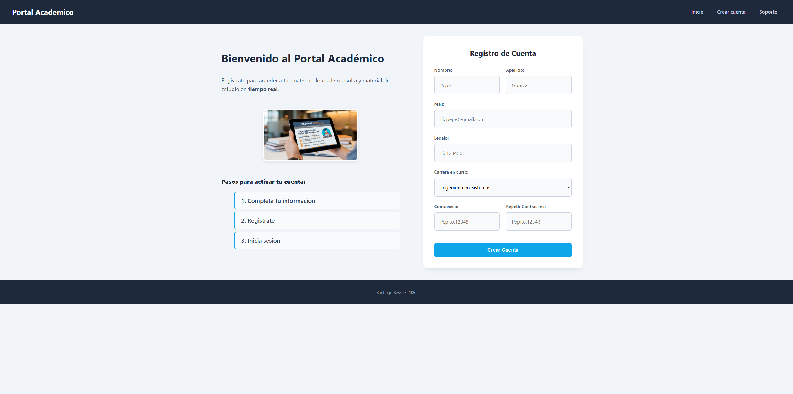

# Portal Academico - Tarea 1

## De que trata el proyecto
Este es el proyecto para la primera unidad de la diplomatura. Armé una página de registro para un portal académico simulando el ingreso a un campus virtual.

Para la interfaz busqué un diseño simple en dos columnas: a la izquierda metí la info de los pasos con la imagen de la tablet y a la derecha armé el formulario adentro de una tarjeta blanca con un poco de sombra y bordes redondeados para que resalte.

## Cómo lo armé
Hice el desarrollo de forma individual aplicando lo que vimos en clase. Estructuré todo con etiquetas semánticas de HTML5 (header, main, article, footer) para que quede bien organizado y cargué las validaciones nativas en los campos del formulario.

Para los estilos usé CSS externo con Flexbox para que la página sea responsive y se acomode bien si se abre desde un celular. También creé variables en el root para manejar los colores institucionales más rápido y le sumé efectos visuales básicos como el hover en los botones y el foco celeste en los inputs cuando estás escribiendo.

## Estructura de archivos
* index.html - Estructura de la página.
* style.css - Estilos y variables.
* public/ - Carpeta con la imagen de la tablet.

## Cómo correrlo
1. Clonás el repositorio: git clone https://github.com/santiagosessa/Tarea-1.git
2. Abrís el index.html en cualquier navegador.

## Autor
Santiago Sessa - Módulo 1 (Unidad 1). Proyecto realizado de manera autónoma.
